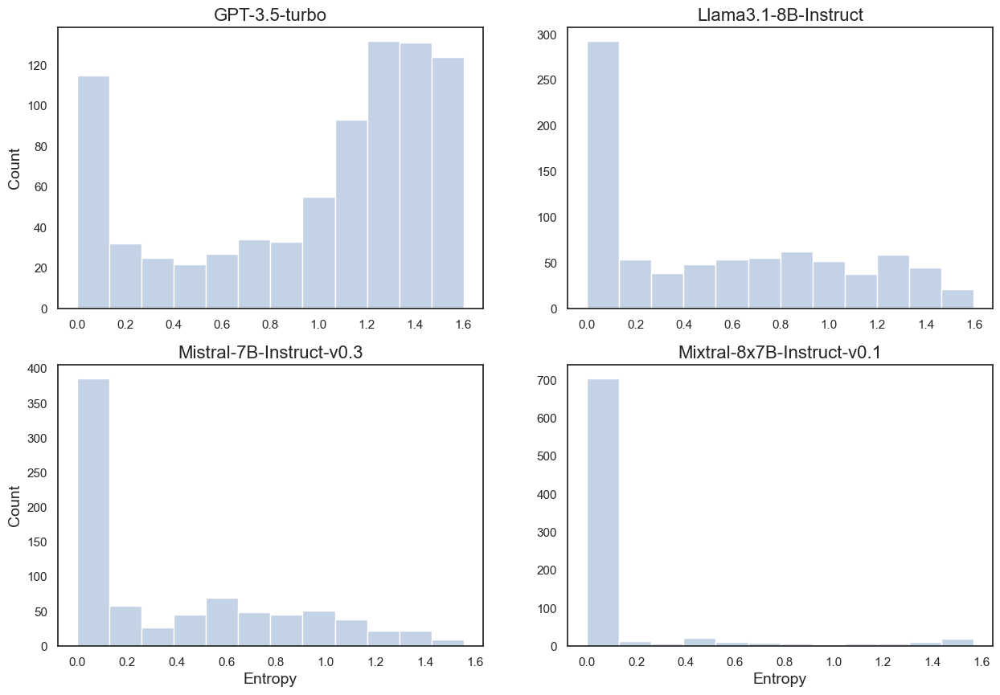
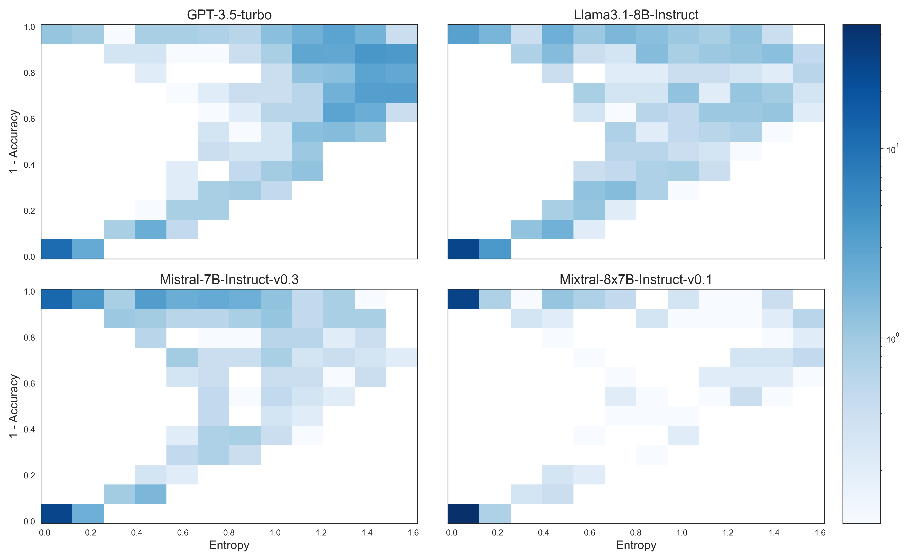

# Testing Large Language Models for Physics Knowledge

[Installation](#installation) | 
[Blablador Access](#blablador) |[Models Running](#model_running) | [Responses cleaning](#cleaning) | [Statistics calculation](#stats) | [Visualization](#vis) 

 This is the official repo for the paper *Testing Large Language Models for Physics Knowledge* [https://arxiv.org/abs/2411.14465](https://arxiv.org/abs/2411.14465)


 Large Language Models (LLMs) have gained significant popularity in recent years for their ability to answer questions in various fields. However, these models have a tendency to "hallucinate" their responses, making it challenging to evaluate their performance. A major challenge is determining how to assess a model's certainty of its predictions and how it correlates with accuracy. In this work, we introduce an analysis for evaluating the performance of popular open-source LLMs, as well as gpt-3.5 Turbo, on multiple choice physics questionnaires. We focus on the relationship between answer accuracy and variability in topics related to physics. Our findings suggest that most models provide accurate replies in cases where they are certain, but this is by far not a general behavior. The relationship between accuracy and uncertainty exposes a broad horizontal bell-shaped distribution. We report how the asymmetry between accuracy and uncertainty intensifies as the questions demand more logical reasoning of the LLM agent while the same relationship remain sharp for knowledge retrieval tasks.

## <a name="installation"></a> Installation

```
git clone https://github.com/ReganovaLisa/Testing_Large_Language_Models_for_Physics_Knowledge.git
pip install -r requirements.txt
```

## <a name="blablador"></a>Blablador Access
This section refers to official documentation [https://sdlaml.pages.jsc.fz-juelich.de/ai/guides/blablador_api_access/](https://sdlaml.pages.jsc.fz-juelich.de/ai/guides/blablador_api_access/).

Blablador (http://helmholtz-blablador.fz-juelich.de) is a service that allows researchers to add their own LLM models to an authenticated web interface.

It also offers a REST API to access the models. The API is compatible to the OpenAI Python Api. The GEOMAR center for Oceanographic Research developed python bindings for Blablador, too: https://git.geomar.de/everardo-gonzalez/blablador-python-bindings

In order to use the API, you need to obtain an API key, available at Helmholtz Codebase, Helmholtz's Gitlab server. This is how you do it:

### Step 1: Register on GitLab

If you don't have a GitLab account yet, go to Helmholtz Codebase's website and register for a new account. You can log in with any EduGAIN account, such as your university account.

### Step 2: Obtain an API key
Go to your profile link, clicking on your profile picture in the top left corner of the screen. Then, click on "Preferences" in the dropdown menu.

In the preferences page, you will see an "Access Tokens" option on the left. Click on it.

Here, you can create a new "Personal Access Token" - this is the API key you need to access Blablador's API. Click in "Add new token", give it a name, such as "Blablador API key", and select the "api" scope. Then, click on "Create personal access token".

You will see a long string of characters. This is your API key. Copy it and save it somewhere safe. You will need it to access Blablador's API.

Important: Keys are valid for at most a year on Helmholtz Codebase. After that, you will need to create a new one.

Done! You have all you need to access Blablador's API.

### Step 3: Paste your API key

In utils.py insert your Blablador API KEY:

```python
API_KEY = "ENTER-YOUR-API-KEY"
```


## <a name="model_running"></a>Model running

1. First retrieve all the models avaliable:
```python
import ast
import json
from blablador import Models, Completions, ChatCompletions, TokenCount
from config import API_KEY, assistant, user, system

models = Models(api_key=API_KEY).get_model_ids()
for i in models:
    print(i)
```

2. Read your data
```python
import json

f = open('en.jsonl')
data = json.load(f)
f.close()
print('Number of questions: ' + str(len(data)))
```

3. Get models' replies (choose model lby its id).
```python
from utils import *

ground_truth_llama, responses_llama = run_model_promting(path_to_questions = 'en.jsonl', path_to_answers = 'responses/responses_one_letter_llama_0_3.txt', model_id = 6,start_range = 0, end_range = 3, N_samples = 20)
```

Our experiments with prompting can be found in prompting.ipynb.

## <a name="cleaning"></a> Responses cleaning
 If nescessary, you can clean the replies from whitespace, new line, etc..:
```python
from utils import *

delete_n('responses/responses_one_letter_llama_0_3.txt', 'responses/responses_one_letter_llama_0_3.txt_cleaned')
```

## <a name="stats"></a>Calculation of Statistics

1. Read the responses and the ground truth:
```python
from utils import *

responses_llama, ground_truth_llama = read_results('responses/responses_one_letter_llama.txt', 'en.jsonl')
responses_gpt, ground_truth_gpt = read_results('responses/responses_one_letter_gpt_corrected.txt', 'en.jsonl')
responses_mixtral, ground_truth = read_results('responses/responses_one_letter_mixtral_corrected.txt', 'en.jsonl')
responses_mistral, ground_truth = read_results('responses/responses_one_letter_mistral.txt', 'en.jsonl')

```
2. Calculate entropy, mean accuracy for the question and save it into pd.DataFrame:
```python
from utils import *

with open('categories.txt', 'r') as f:
    cat = f.read()
    categories = ast.literal_eval(cat)
    
df_llama = make_dataframe(responses_llama, ground_truth_llama, categories=categories)
df_gpt = make_dataframe(responses_gpt, ground_truth_gpt, categories=categories)
df_mistral = make_dataframe(responses_mistral, ground_truth, categories=categories)
df_mixtral = make_dataframe(responses_mixtral, ground_truth, categories=categories)

print(df_llama.head())
```

## <a name="vis"></a> Visualization
1. Entropy obtained from the distribution of answers to single questions of the mlphys101 dataset for all four models.
```python
import seaborn as sns
import matplotlib.pyplot as plt


dataframes = [df_gpt, df_llama, df_mistral, df_mixtral]
titles = ['GPT-3.5-turbo', 'Llama3.1-8B-Instruct', 'Mistral-7B-Instruct-v0.3', 'Mixtral-8x7B-Instruct-v0.1']
x_labels = [' ', ' ', 'Entropy', 'Entropy']
y_labels = ['Count', ' ', 'Count', ' ']

sns.set_style('white')
fig, axs = plt.subplots(2, 2, figsize=(15, 10))


axs = axs.flatten()

for i, (df, title, x_label, y_label) in enumerate(zip(dataframes, titles, x_labels, y_labels)):
    sns.histplot(data=df, x="Entropy", kde=False, color="lightsteelblue", ax=axs[i], bins=12)
    axs[i].set_title(title, fontsize=16)
    axs[i].set_xlabel(x_label, fontsize=14)
    axs[i].set_ylabel(y_label, fontsize=14)

plt.tight_layout()
plt.savefig('hist__no_grid.png', dpi=300)
plt.show()

```


2. Two-dimensional Histogram of Error Rate (1 - Accuracy) vs. Entropy across Models.
```python
from mpl_toolkits.axes_grid1 import ImageGrid
import seaborn as sns
import matplotlib.pyplot as plt
from matplotlib.colors import LogNorm

# Sample datasets and titles for demonstration
datasets = [df_gpt, df_llama, df_mistral, df_mixtral]
titles = [
    'GPT-3.5-turbo', 
    'Llama3.1-8B-Instruct', 
    'Mistral-7B-Instruct-v0.3', 
    'Mixtral-8x7B-Instruct-v0.1'
]

sns.set_style('white')

fig = plt.figure(figsize=(15, 15))
grid = ImageGrid(
    fig, 111,  
    nrows_ncols=(2, 2),  
    axes_pad=0.5,  
    cbar_mode="single",
    cbar_location="right",
    cbar_pad=0.3
)


for i, (df, title) in enumerate(zip(datasets, titles)):
    h = grid[i].hist2d(
        df.Entropy, 
        df['1 - Accuracy'], 
        bins=(12, 12), 
        cmap=plt.cm.Blues,
        density=True, 
        norm=LogNorm()
    )
    grid[i].set_title(title, fontsize=16)
    
    
    if i % 2 == 0:  
        grid[i].set_ylabel('1 - Accuracy', fontsize=14)
    if i >= 2:  
        grid[i].set_xlabel('Entropy', fontsize=14)


fig.colorbar(h[3], cax=grid.cbar_axes[0], orientation='vertical')

plt.savefig('curve_grid.png', dpi=300)

```




## Citation
We kindly ask that you cite our work if you find it useful in your research:

```bibtex
@misc{reganova2024testinguncertaintylargelanguage,
      title={Testing Uncertainty of Large Language Models for Physics Knowledge and Reasoning}, 
      author={Elizaveta Reganova and Peter Steinbach},
      year={2024},
      eprint={2411.14465},
      archivePrefix={arXiv},
      primaryClass={cs.CL},
      url={https://arxiv.org/abs/2411.14465}}

